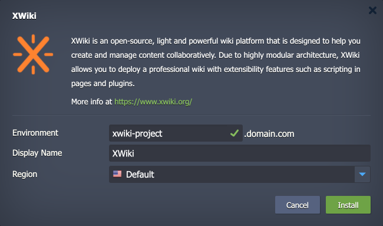

 

# XWiki

The package deploys the [XWiki](https://www.xwiki.org/) solution - an open-source, light and powerful wiki platform that is designed to help you create and manage content collaboratively. Due to highly modular architecture, XWiki allows you to deploy a professional wiki with extensibility features such as scripting in pages and plugins.

## Environment Topology

This package creates a dedicated XWiki environment that contains one application server and one database container. It automatically deploys and sets the XWiki application. The automatic vertical scaling is enabled out of the box, and [horizontal scaling](https://www.virtuozzo.com/application-platform-docs/automatic-horizontal-scaling/) can be configured (if needed). The default software stacks utilized in the package are the following:

- Tomcat 9 application server (Java 17)
- MariaDB 10 database
- XWiki 16.9.0

## Deployment to Cloud

To get your XWiki solution, click the "**Deploy to Cloud**" button below, specify your email address within the widget, choose one of the [Virtuozzo Public Cloud Providers](https://www.virtuozzo.com/application-platform-partners/), and confirm by clicking **Install**.

> If you already have a Virtuozzo Application Platform (VAP) account, you can deploy this solution from the [Marketplace](https://www.virtuozzo.com/application-platform-docs/marketplace/) or [import](https://www.virtuozzo.com/application-platform-docs/environment-import/) a manifest file from this repository.

## Installation Process

In the opened installation window at the VAP dashboard, provide a preferred environment and display names, choose a region (if available), and confirm the installation.

Your XWiki application will be automatically installed in a few minutes.
